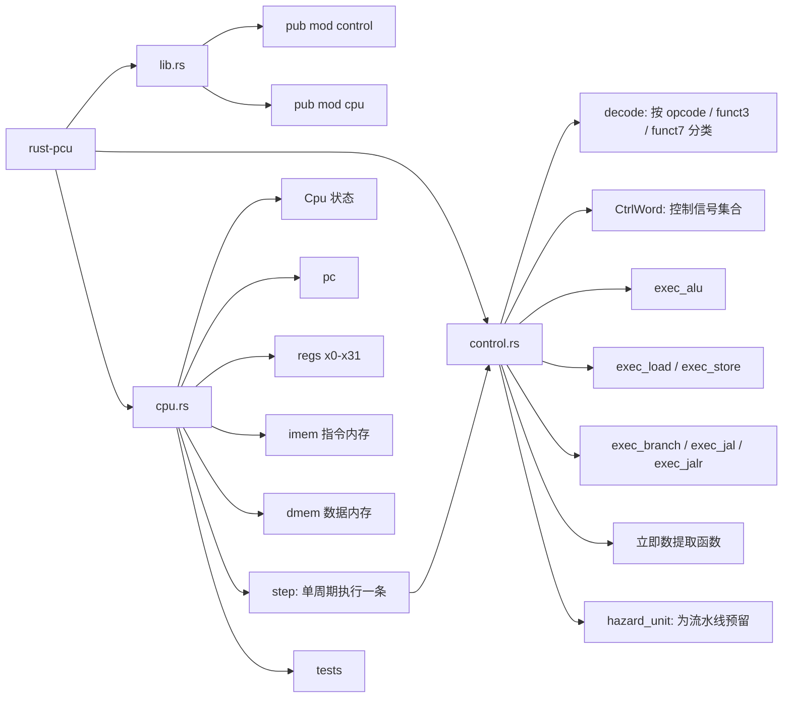

# rust-pcu 设计导图与逻辑图

这份图不是泛泛而谈的 CPU 示意图，而是按你当前 `rust-pcu` 项目的真实结构整理的学习版设计图。

使用到的思路来源：
- `word-docx` skill：用来把内容组织成清晰的文档结构
- 项目源码：`src/cpu.rs`、`src/control.rs`、`src/lib.rs`

## 1. 整体设计导图

先看这个项目现在到底分成了哪几层：

```text
rust-pcu
|- lib.rs
|  |- 暴露模块
|
|- control.rs
|  |- 指令解码 decode
|  |- 字段提取 inst_rd / inst_rs1 / inst_rs2
|  |- 立即数提取 inst_i_imm / inst_u_imm / inst_jal_imm / ...
|  |- 执行函数 exec_alu / exec_load / exec_store / exec_branch / ...
|  |- 冒险控制 hazard_unit
|
|- cpu.rs
   |- CPU 状态: pc / regs / imem / dmem
   |- 单步执行 step()
   |- 把 decode 和 exec 串起来
   |- 单元测试
```



## 2. 指令执行逻辑图

你现在这版 CPU 的核心，其实就是 `Cpu::step()`。
它做的事情可以理解成：取一条指令，交给 `control.rs` 解码，再按解码结果执行，最后更新 `pc`。

```mermaid
flowchart TD
    S[开始 step] --> A[用 pc / 4 计算指令索引 idx]
    A --> B{idx 是否越界}
    B -- 是 --> R[直接 return]
    B -- 否 --> C[取指 inst = imem[idx]]
    C --> D[decode(inst)]
    D --> E[提取 rs1 / rs2 / rd / opcode]
    E --> F[默认 next_pc = pc + 4]
    F --> G{按 opcode 进入哪一类}

    G --> G1[0x33 OP]
    G --> G2[0x13 OP-IMM]
    G --> G3[0x03 LOAD]
    G --> G4[0x23 STORE]
    G --> G5[0x37 LUI]
    G --> G6[0x17 AUIPC]
    G --> G7[0x63 BRANCH]
    G --> G8[0x6f JAL]
    G --> G9[0x67 JALR]
    G --> G10[其它: 暂不处理]

    G1 --> H1[exec_alu(rs1, rs2)]
    G2 --> H2[exec_alu(rs1, imm)]
    G3 --> H3[addr = rs1 + imm; exec_load]
    G4 --> H4[addr = rs1 + imm; exec_store]
    G5 --> H5[rd = imm_u]
    G6 --> H6[rd = pc + imm_u]
    G7 --> H7[exec_branch]
    G8 --> H8[ret = pc + 4; next_pc = pc + jal_imm]
    G9 --> H9[ret = pc + 4; next_pc = (rs1 + imm) & !1]
    G10 --> J[保持默认 next_pc]

    H1 --> K[如需要则写回 rd]
    H2 --> K
    H3 --> K
    H4 --> L[无需写回寄存器]
    H5 --> K
    H6 --> K
    H7 --> M{branch taken?}
    M -- 是 --> N[next_pc = pc + b_imm]
    M -- 否 --> J
    H8 --> K
    H9 --> K

    K --> P[提交 pc = next_pc]
    L --> P
    N --> P
    J --> P
    P --> Q[强制 regs[0] = 0]
    Q --> T[结束]
```

## 3. 设计逻辑为什么这样拆

这套拆法的核心目的，是把“看懂指令”和“真正执行”分开。

1. `control.rs` 负责“翻译指令”
   这里回答的是：这条指令属于哪一大类？是 `ADD` 还是 `SUB`？要不要读内存？要不要写寄存器？要不要跳转？

2. `cpu.rs` 负责“驱动执行”
   这里回答的是：已经知道它是什么指令了，那寄存器该怎么读？ALU 该怎么调？结果写回哪里？`pc` 最后更新成什么？

3. 执行函数单独拆开
   比如 `exec_load`、`exec_store`、`exec_branch`、`exec_jal`，这样你以后查 bug 时，不需要在 `step()` 里翻一大团 `match`。

4. `CtrlWord` 是中间桥梁
   它像是 decode 阶段给 execute 阶段开的“任务单”。

## 4. 你现在这版项目的发展过程

如果把这个项目当成学习路线，它现在大概走到了这里：


## 5. 当前代码在“CPU 设计图”里的位置

从学习角度，你可以这样理解现在的完成度：

- 已经有“单周期 CPU 骨架”
- 已经把 RV32I 里一批常见基础指令接上了
- 已经开始考虑控制流跳转
- 已经为以后做流水线准备了 `hazard_unit`

但还没有完全展开的方向还有这些：

- 更完整的异常/非法指令处理
- 更严格的对齐检查和访存错误处理
- 总线层抽象
- 真正的多级流水寄存器
- forwarding / stall / flush 的完整流水线实现

## 6. 学这张图时建议怎么读

如果你想真正吃透，不要从 `control.rs` 的最细节开始啃，建议按这个顺序看：

1. 先看 `Cpu` 里有哪些状态
2. 再看 `step()` 的总流程
3. 再看 `decode()` 怎样按 opcode 分类
4. 再看 `exec_*` 系列函数
5. 最后再回头看立即数提取函数

因为 CPU 真正最重要的问题不是“某个位段怎么切”，而是：

- 指令从哪里来
- 谁负责解释它
- 谁负责执行它
- 执行完以后状态怎么更新

---

如果你后面想继续，我可以在这份文档基础上再给你补第二版：
- `单周期数据通路图`
- `JAL / JALR / BRANCH 专题图`
- `流水线冒险图`
